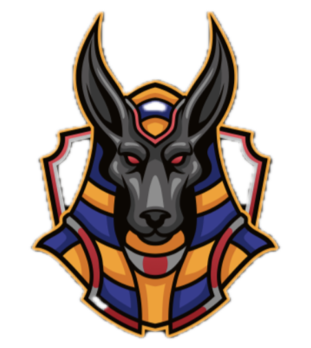

# Gyza Project



This repository contains the source code for **Gyza**, a full-stack application that consists of a **Django** backend and a **React + TypeScript** frontend.

---

Gyza is a full-stack platform where users can create and share visually striking images that secretly contain encrypted personal
stories or messages. Using steganography, the app hides text within the pixels of images—
like modern-day hieroglyphs. These "glyphs" are publicly viewable, but only those with the secret can unlock and read the
hidden content. Inspired by the mystery of ancient Giza, Gyza brings a new kind of storytelling to the digital age—where art
becomes a vessel for secret expression.

Full documentation is available in the [Wiki](https://github.com/kounterSD/Gyza/wiki).

# Installation Guide

## Prerequisites
- Python 3.9.6 or higher
- Node.js 18+ and npm
- Git

## Clone repository

`git clone https://gitlab.rz.htw-berlin.de/s0597432/gyza.git`

## Backend Setup (Django)

### 1. Navigate to /backend
`cd ./gyza/backend`

### 2. Set Up Python Virtual Environment

```
python -m venv .venv
source venv/bin/activate 
```

### 3. Install Dependencies

`pip install -r requirements.txt`

### 4. Database Setup
`python manage.py migrate`

### 5. Create SuperUser (Optional)

`python manage.py createsuperuser`

### 6. Run Development Server

`python manage.py runserver`

Backend will be available at `http://localhost:8000`

## Frontend Setup (React)

### 1. Navigate to ./frontend/

`cd ./gyza/frontend/`

### 2. Install Dependencies

`npm install`

### 3. Environment Setup
Create a `.env` file in the frontend root directory:

`VITE_API_URL=http://localhost:8000/api`

### 4. Run Development Server

`npm run dev`

Frontend will be available at `http://localhost:5173`


